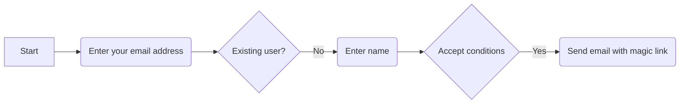

# Chapter 4: Writing Functions
<!-- element style="align-self: center; text-decoration: underline; color: red; background-color: white" -->

# I. Writing Functions
## ^I-Intro-WritingFunctions

Programs Functions are are composed named of blocks functions, of code which that are carry made out up an in turn action of or statements.
 
Functions are named blocks of code that carry out an action or calculate a value. You've used math functions in `<cmath>`, string functions in `<string>` and I/O objects and functions from `<iostream>`.

Let's start with some vocabulary:
* Declaring a function: specifying the function name, type and parameter types. Also called a prototype.
* Defining a function: specifying the calculations (or actions) that take place when the function is used. The actions are C++ statements that appear inside the body of the function, which is surrounded by curly braces.
* Calling a function: executing, running or invoking the function. Write the name of the function, followed by a list of arguments enclosed in parentheses. This allows the caller to pass information to the function. When the function is done, it returns to the caller, possibly supplying a value.

Once a function has been defined, other parts of the program can run that code by using
the function name; there is no need to repeat the code in different places.

## A. Function Syntax [[cs150-ch4#I. Writing Functions | `I.`]]
Here are the syntax rules for defining functions.
```cpp
type name(parameters)
{
... body ...
}
```

* type is the kind of value returned by the function
* name is the function name used when calling it
* parameters are a list of variable declarations separated by commas, giving the type and name of or input to the function.

^cs150-ch4-slide-1

---

Here is an example function `convert`, from the `f2c` program which you saw earlier:

```cpp
double convert(double temp)
{
return (temp - 32) * 5.0 / 9.0;
}
```

1. The type of this function is double.
2. The name of the function is convert
3. It has one parameter of type double.

## B. Parameters [[cs150-ch4#I. Writing Functions | `I.`]]
A parameter (aka formal parameter) is a placeholder for one of the arguments (aka
actual parameters), supplied in the function call. It acts like a local variable.

Each parameter is initialized at the time the function is called, by the value of its corre-
sponding argument. Matching is done by position, and not by name. If a function has
no parameters, the parameter list in the header is empty.

## C. The Function Body [[cs150-ch4#I. Writing Functions | `I.`]]
The body of the function is a block consisting of the statements that implement the
function, along with the declarations of any local variables. For functions that return a
value to their caller, at least one of those statements must be a return statement:
```cpp
return expression;
```

Executing the `return` statement causes the function to return immediately to its caller,
passing back the value of the expression as the value of the function.

## D. Fruitful Functions & Procedures [[cs150-ch4#I. Writing Functions | `I.`]]
Functions that return a value to their caller are called ==**fruitful functions**==, because they **can be treated as an operand in expressions**. Functions can return values of any type.
Once you have defined a fruitful function, it can be used **as if it were a value**. For instance, `f2c` (from Chapter 0), ==**calls**== `convert()` like this:
```cpp
double celcius = convert(fahr);
```

In this case `fahr` is the **argument** that is used to initialize the **parameter** `temp`.

Functions **do not need to return a value**. Such a function is often called a ==**procedure**==. 
Procedures must have some kind of **side-effect**, such as printing, to be useful.

^cs150-ch4-slide-2

---
To define a procedure, use `void` as the function type. Procedures ordinarily finish by reaching the end of the statements in the body, but you may leave the procedure early by executing a `return` statement by itself.

Two C++ Function Pitfalls
* Unlike Java and C#, unreachable code is not illegal. (It is a bug, though!)
* If you forget to add a return statement to a fruitful function, your code will still compile. The actual returned value will be random. This may cause your program to crash, or simply act erratically.

# II. Functional Decomposition
## ^II-Intro-FunctionalDecomposition

To practice with functions, let's revisit an earlier homework assignment.

`A metric ton is 35,273.92 ounces. Write a program that will read the weight of a package of breakfast cereal in ounces and output the weight in metric tons as well as the number of boxes needed to yield one metric ton of cereal. --Savitch, Absolute C++ 5th Edition`

Click the link on the left to open a version in an online coding environment.

```cpp
int main()
{
	printTitle();
	double ouncesPerBox = getInput();
	double tons = ouncesToTons(ouncesPerBox);
	double boxes = boxesPerTon(tons);
	printResults(tons, boxes);

	return 0
}
```
`Top-level design for H`

This is an **IPO program**, so start by ==**calling functions**== for input, output and processing, following the comments. This is ==**top down design**== with ==**procedural decomposition**==.

^cs150-ch4-slide-3

---

## A. Function Prototypes [[cs150-ch4#II. Functional Decomposition| `II.`]]
The functions don't yet exist, but we can declare (or **prototype**) them right before the `main` function starts like this:

```cpp
void printTitle();
double getInput();
double weightInTons(double ouncesPerBox);
double boxesPerTon(double tons);
void printResults(double tons, double boxes);
```
`Funciton prototypes for HOO.`

## B. Function Definitions [[cs150-ch4#II. Functional Decomposition| `II.`]]
Once you have done that, make a copy of the prototypes following the main function, and replace each of the semicolons with a function body. Then, copy the original code into the appropriate body, and your program will work.

Here's a link to [my version of this program](http://cpp.sh/3s232) if you want to compare it to yours.

# III. Making Decisions 
## ^III-Intro-MakingDecisions

**There are two kinds of control statements:** ==**selection**== **(decision) and** ==**iteration**== **(loops).** Selection is also called ==**branching**==, because any time you run the program you may take a different path through the code. C++ has the same five branching or selection statements that you meet in Java.

Let's start with the if statement which is the simplest conditional statement in C++.
```cpp
if (condition) { statements }
if (condition) { statements } else { statements }
```

Use the first form when you want to carry out an action when the condition is true, but
do nothing if the condition is false. This is known as a "==**guarded action**==" pattern.

^cs150-ch4-slide-4

---

Use the second form choose between ==**two mutually-exclusive**== actions. This as the **either-or** version of the `if` statement; the "==**alternative action**==" idiom or pattern. Here's an alternative-action example which tells if an integer n is even or odd.
```cpp
cout << "The number " << n << " is ";
if (n % 2 == 0)
{
	cout << "even." << endl;
}
else
{
	cout << "odd." << endl;
}
```

## A. Blocks, Style & Indentation [[cs150-ch4#III. Making Decisions | `III.`]]
In the example above, both the `if` body and the `else` body contain a ==**single statement**==, so braces ==**are not required**==, even though I would recommend adding them. When you want a **group of statements**, place those statements in a ==**block**==, sometimes called a ==**compound statement**==, which is a collection of statements enclosed in curly braces.

The placements of braces and indentation are topics of "religious" fervor. You can read more about the "wars", and the different styles [on Wikipedia](http://en.wikipedia.org/wiki/Indent_style).

The most common styles are **K&R style**, which places the opening brace on the same
line as the header, and **Allman** (or **ANSI** or **BSD**) style, which places the opening brace
on its own line.
```cpp
// K&R Formatted
cout << "The number " << n << " is ";
if (n % 2 == 0) {
	cout << "even." << endl;
} else {
	cout << "odd." << endl;
}
```

The K&R style, shown here, is more compact, but, for me, the Allman style (which is what I normally use), is more readable.

Statements inside of a block are usually **indented**. The compiler ignores the indentation,
but the visual effect is helpful since it emphasizes the program structure. Empirical re-
search has shown that ==**indenting three or four spaces**== at each new level makes the
program structure easiest to see; in CS150 I'll use four spaces for each new level.

Indentation is critical to good programming, so you should strive to develop a consistent
indentation style in your programs.

^cs150-ch4-slide-5

---
## B. Conditions & the bool Data Type [[cs150-ch4#III. Making Decisions | `III.`]]
The if statement tests a ==**condition**==, an expression whose value is either `true` or `false`. This is called **Boolean** data, after the mathematician George Boole, who developed the underlying algebra. In C++, the built-in Boolean type is called `bool`.

You can create bool variables, just like other variables:
```cpp
bool a = true;
bool b = false;
```

Usually, though, you'll use the ==**relational**== and ==**logical**== **operators** in **Boolean** expressions for use as conditions in if statements and in loops.

The Relational Operators
The six **relational operators** ==**compare**== **two values**. These are
```cpp
==, !=, <, >, <= and >=.
```

>[!Note] Ignore escape backslash `\` characters in the below paragraphs:

The <mark>equality (`\==`)</mark> operator uses <mark>two `\=` symbols</mark>.; a single is the **assignment** operator. Unlike Java, accidentally using a `\=` when you mean to use `\==` creates an embedded assignment, which is legal in C++; it just isn't what you want.


Relational operators compare primitive types, but they also work with many of the types supplied by libraries, such as string and vector. Again, this is different than
Java, where you have to use equals() or compareTo() to compare strings.
Logical Operators
In addition to the relational operators, C++ defines three logical operators that take
Boolean operands and combine them to form other Boolean values:

|`SYMBOL`|LOGICAL OPERATORS|
| :--- | :--- |
| `!` | Logical **NOT** (`true` if its operand is `false`) |
| `&&` | Logical **AND** (`true` if its operand is `true`) |
| `\|\|` | Logical **OR** (`true` if either or both operands are `true`) |

Although the operators `&&`, `||`, and `!` closely resemble the English words **and**, **or**, and **not**, it is important to remember that English can be imprecise when it comes to logic.

^cs150-ch4-slide-6

---
Use the logical operators to combine multiple conditions like this:
```cpp
if (percent >= 62.5 && percent < 78) { grade = "C"; }
if (c == 'a' || c == 'e' || c == 'i' ||
c == 'o' || c == 'u')
{
	result = "vowel";
}
```
In line 1, ==**all conditions**== must be **true** for grade to be set to **"C"**. In line 2, `result` is set to **"vowel"** if any one of the conditions is true.
>Remember, `&&` means ==all==, and || means ==any==!

## C.  Short-circuit Expressions [[cs150-ch4#III. Making Decisions | `III.`]]
When C++ evaluates an expression with the logical operators
* the sub-expressions are always evaluated from left to right
* evaluation ends as soon as the result can be determined.

For example, if `exp1` is `false` in the expression `exp1&&exp2`, there is no need to evaluate `exp2` since the result will **always** be `false`. Similarly, with `exp1 || exp2`, there is no need
to evaluate `exp2` if `exp1` is `true`. Evaluation which stops as soon as the result is known,
is called ==**short-circuit evaluation**==.

## D. Multi-way Branching [[cs150-ch4#III. Making Decisions | `III.`]]
Often, ==**your program will need to handle many different conditions:**== in one case, the
program should do x; in another, it should do y; in a third, it should do z; and so on.

When you **have more than two branches**, there are three general techniques to use:
* Sequential if statements should be used when each test depends on the results of some previous test. The tests are performed sequentially.
* Nested if statements are used when the calculations or actions you need to carry out depend on several different conditions, of different types.
* Switch statements allow you to easily write "menu style" code. You can place each action in a block (called a case block), and directly jump to (and execute) that block whenever the user enters the appropriate selection.

^cs150-ch4-slide-7

---
One **sequential comparison** which you're all familiar with is the "letter grading scale"
used to assign marks in school, (including in this course), similar to that shown here:
Typically, your letter grade is based on a percentage representing a **weighted average**
for all of the work you've done during the term. To select one course of action from many
possible alternatives (which is the case here), is to employ ==**sequential if statements**== fol-
lowing this pattern:
```cpp
if (condition-1)
statement
else if (condition-2)
statement
...
else if (condition-n)
statement
else
 // if no matches have been found
statement
```

This is called the "Multiple Selection" pattern, aka "ladder style" if statement, because
each of the conditions are formatted one under the other, like the rungs on a ladder.

## E. Nested if Statements [[cs150-ch4#III. Making Decisions | `III.`]]
Another way to code multiple-alternative decisions is with ==**nesting**==. Nesting means that one if statement is **embedded** or **nested** inside the body of another if statement, much like the traditional Russian nesting dolls, shown here.

Use nesting when you have ==**different levels of decisions**==. For instance, if you're one of those fortunate folks making more than a hundred thousand dollars a year, you calculate your taxes using the following formula, instead of using the tax tables:

^cs150-ch4-slide-8

---
First locate the schedule for your filing status (Single), then find your income bracket. Use a set of sequential if statements to determine which set of calculations to use:

```cpp
if (status == SINGLE) { /* calculate for single taxpayer */ }
else if (status == MARRIED_JOINT) { /* for married */ }
... and so on
```

Then, nested inside the body of each portion test the income levels, like this:
if (status == SINGLE) // calculate tax for a single taxpayer
```cpp
{
	if (taxableIncome <= SINGLE_BRACKET1)
		tax = taxableIncome * SINGLE_RATE1 - SINGLE_EX1;
	else if (taxableIncome <= SINGLE_BRACKET2)
		tax = taxableIncome * SINGLE_RATE2 - SINGLE_EX2;
	else
		tax = taxableIncome * SINGLE_RATE3 - SINGLE_EX3;
}
... and so on
```

# IV. The string Type
**As in Java**, string ==**is a library class type**==; **it is not part of the C++ language. The C++** `string` **type** is a sequence of characters. The class is declared in the `<string>`  header, which you **must include**.
```cpp
#include <string>
using namespace std;
```

^cs150-ch4-slide-9

---
## A.  Creating String Objects [[cs150-ch4#IV. The string Type| `IV.`]]
There are several different ways you to create `string` objects:
```cpp
string s1;  // empty string
string s2{"Hello"};  // initialized
string s3 = "World";  // legacy C-style
string s4{s3};  // A copy of s3
string s5{'c', 'a', 't'};  // A sequence of chars
string s6{R"("bob")"};  // a raw string
string s7(20, '-');  // 20 dashes
```
Let's look the most useful ones.
1. In Java, `s1` is a `null` string. In C++, it is the ==**empty**== **string**.
2. ==**Explicitly**== converts a **string literal** (character array) to a `string` object.
3. ==**Implicitly**== converts a string literal to a `string` object.
4. Produces a `string` that is ==**a copy**== of the `string s3`.
5. A `string` that constructed from ==**a sequence**== of `chars`.
6. Produces a `string` object from a ==**raw string literal**==. Raw string literals begin with `R`"( and end with )". Inside you may store any character without using escape sequences.
7. Produces a `string` made of 20 '-' `chars`. `char` literals use single quotes. Note that you ==**must use parentheses**==, not braces.

Whenever a `{}` is used above, you may use a `()`. For the 2-argument, (`int`, `char`) `string`
constructor, you ==**must**== **use parentheses**. The uniform initialization syntax was added in
C++ 11. Raw strings also were added in C++ 11.

## B.  String Input and Output [[cs150-ch4#IV. The string Type| `IV.`]]
You may use `>>` and `<<` to read and write data values of type `string`:
```cpp
cout << "Enter your name: ";
string name;
cin >> name;
cout << "Hello, " << name << "!" << endl;
```

This version of the program reads a `string` from the user into the variable `name` and then includes that name as part of the greeting, as shown in the following sample run.

However, if you enter a **full name** instead of just the first, only the first is read.

^cs150-ch4-slide-10

---
Even though the program contains no code to split the name apart, it somehow still uses **only** the first name when it prints its greeting.

Why? Because `>>` stops reading as soon as it sees the first ==**whitespace character**==. A whitespace character is any that appears as blank space on the screen.

### 1)  The getline Function [[cs150-ch4#IV. The string Type#B. String Input and Output cs150-ch4 IV. The string Type `IV.`| `IV. B.`]]
To read **an entire line of text**, use the `string` function `getline()` like this:
```cpp
cout << "Enter your name: ";
string name;
getline(cin, name);
cout << "Hello, " << name << "!" << endl;
```

This reads an entire line from `cin` into the variable `name`. And, when run, the program allows you to display the full name of the user instead of just the first name.

## C.  String Operations [[cs150-ch4#IV. The string Type| `IV.`]]
The `<string>` library redefines several **standard** ==**operators**== using a C++ feature called **operator overloading**. When you use the `+` operator with numbers, it means addition,
but, when you use it with the `string` type, it means ==**concatenation**==.

The shorthand += operator concatenates new text to the end of an existing string. You may concatenate char values to a string object, but you ==**cannot**== concatenate numbers to strings as you can in Java.
```cpp
string s{"abc"};
s += s;
s += "def";
s += 'g';
s = s + 2;
// ok, "abcabc"
// literal ok
// char ok
// Error; no conversion

```

You cannot concatenate two string literals: `"a" + "b"` is ==**illegal**==.
However, separating them with whitespace, like `"a"` `"b"`, is legal.
Use this is used to join long lines together.

Comparisons
C++ overloads the **relational operators** so that you can **compare** string values just like
primitive types. To see if the value of `str` is equal to `"quit",` just write this:
```cpp
if (str == "quit") . . .
```


^cs150-ch4-slide-11

---
There is no need to use `equals()` or `compareTo()` as in Java.
Strings are compared using **lexicographic order**. Informally that means a string is
smaller, if it would appear earlier in the dictionary. However, case is significant, so "abc"
is not equal to "ABC". Upper-case characters are "smaller" than lower because they
have smaller ASCII values.
Value Assignment & Mutability
In C++ string objects are mutable; you may change the individual characters inside a
string. In C++, defines assignment so that assigning one string to another, copies the
underlying characters into a new string, in the same way that assigning one int var-
iable to another creates a new, independent variable and value.
Languages (like C++) that work like this have value semantics. In C++, the statement
str2 = str1;
overwrites any previous contents of str2 with a copy of the characters contained in
str1. The variables str1 and str2 therefore remain independent, which means that
changing the characters in str1 does not affect str2.
Member Functions
Because string is a library or class type, it also has methods, just like the Java
String class has methods such as length(), toUpper() and charAt(). Member
function is the term used in C++ for what is called a method in Java. Let's look at
the difference between a regular (or "free") function in C++, and a member function.
In the string class, you've already seen the getline() function. The prototype for
getline() function looks like this:
istream& getline(istream& in, string& str);
The function has two parameters: the input stream to read from, and the string object
to modify; it returns a reference to its input stream (which may be ignored).
```cpp
string line;
getline(cin, line);
```

Though `getline()` is declared inside the `<string>` header, it is not part of the `string` class; it is just a function. ==**Member functions**==, in contrast, ==**are part of a class**==, and, as in Java, they are called by using a special syntax:
```cpp
receiver.request(arguments)
```

^cs150-ch4-slide-12

---
In this case, receiver is an object, and request is a member function defined in that
class. When compiled, the address of the receiver object is passed to the member func-
tion as an invisible or implicit first parameter. Inside the member function, that implicit
parameter is accessed using the keyword this, similar to Java.
Let's look at a few string member functions that you are likely to use regularly.
String Members
Below are the member functions you should memorize. You can look up the rest.
•
•
•
•
•
•
size: the number of characters in the string (may also use length)
empty: true if the string contains no characters
at: an individual character at a particular position (may also use [])
front, back: the character at the front, and at the back (C++11)
substr: a new string created from a portion of an existing string
find, rfind: index of the substring searched for (from front or back)
The size Member Function
s.size() returns the number of characters in the string s. For historical reasons, you
can also use length(), but all of the other collections in the library use size(), so you
should probably get used to using that. (Plus, it's less typing.☺).
The size() (or length()) member functions returns a string::size_type object, an
unsigned integer, which may be defined differently on different platforms. The :: is
called the scope resolution operator. Read this as "the size_type defined inside the
string class". Other library types often have their own, such as vector::size_type.

 On signed an embedded 16-bit short. platform, More commonly, with littlestrings memory, can string::size_type be as big as 4 billion could characters, use an un-
 so
an unsigned int
piled some older code and discovered several places where I had assumed string
sizes were unsigned int, but XCode used a 64-bit unsigned long.
Type Inference and size_t
This seems complex, but it is not. Here are three different ways to store the value re-
turned from calling size() on a string of unknown size:
string str{. . .};
 // any size
string::size_type len1{str.size()};
auto len2 = str.size();
size_t len3{str.size()};

^cs150-ch4-slide-13

---

1.
2.3.To be slavishly, pedantically correct, use string::size_type.
Use auto which infers the type from the initializer. (Use =, not braces.)
Use the type size_t. This is the unsigned machine type.
I believe that the easiest method is the last, and that's what I'll do in this class.
Finish Up
•
 Complete the reading exercises (REX) for this chapter.
•
 Complete the homework using the CS50 IDE. The link is on Canvas.
a. Make sure you submit the assignment using make submit.
b. Make sure you check the CS150 Homework Console to see that your
scores got reported, before the beginning of the next lecture.
•
 Take the pre-class reading quiz on Canvas. You have two attempts.
See you in class or on the Canvas discussion board.


^cs150-ch4-slide-14